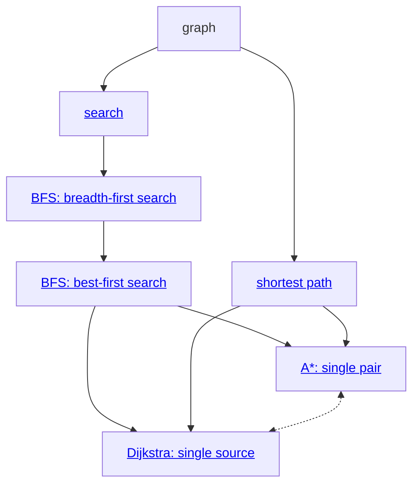

1. dp
2. memorized
3. graph theory

```mermaid
flowchart TD
    A[graph]
    B[<a href='https://en.wikipedia.org/wiki/Search_algorithm'>search</a>]
    C[<a href='https://en.wikipedia.org/wiki/Shortest_path_problem'>shortest path</a>]
    D[<a href='https://en.wikipedia.org/wiki/Breadth-first_search'>BFS: breadth-first search</a>]
    E[<a href='https://en.wikipedia.org/wiki/Best-first_search'>BFS: best-first search</a>]
    F[<a href='https://en.wikipedia.org/wiki/A*_search_algorithm'>A*: single pair</a>]
    G[<a href='https://en.wikipedia.org/wiki/Dijkstra%27s_algorithm'>Dijkstra: single source</a>]

    A --> B
    A --> C
    B --> D
    D --> E
    E --> F
    E --> G
    C --> F
    C --> G
    F <-.-> G
```

4. continuous optimize
